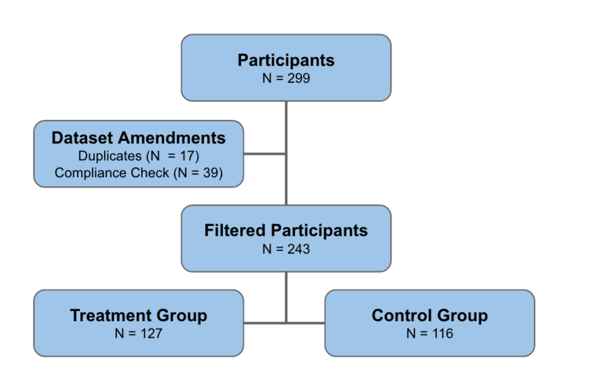

```{r setup, include=FALSE}
knitr::opts_chunk$set(echo = TRUE)
```

## Experimental Materials & Randomization Engineering

The ideal experiment to determine whether all-inclusive pricing impacted the satisfaction levels of restaurant diners would have included selecting a random sample of restaurants across an urban environment (i.e. New York or San Francisco) and within each restaurant, randomly selecting individuals to be treated to the all-inclusive rate or the standard rate. This would have allowed a live experiment where we may have been able to cut across multiple covariates to determine more granular reasoning for a potential outcome. However, given the lack of resources and restaurateur connections, the next best option was to somewhat replicate the experience of eating in a restaurant via online surveys. 

Prior to the final experiment, the group conducted several preliminary surveys to learn the nuances around Amazon’s Mechanical Turk and Qualtrics. Through these early surveys the team was able to improve the survey flow and construction to provide a more robust outcome including: 

Mitigating risk of repeat survey participants
Restricting respondent’s locations to California, New York, Pennsylvania, and DC
Implementing a Compliance Check near end of survey
Randomizing so equal number of treatment and control respondents flow through survey

While the group did not succeed in preventing repeat responders from initiating a second survey, the IP Address of each user was captured from Mechanical Turk and this was used to filter all results from duplicate individuals from the final analysis. Furthermore, the preliminary surveys yielded responses from individuals primarily from outside the United States. The team subsequently decided to isolate responses from four states and districts within the country that have large metropolitan areas. The plot below shows the high concentrated of respondents in the desired regions. The responses captured from outside these regions could be due to extraneous factors (e.g. Turks vacationing or moving locations but not having their profile updated).


```{r cars}
library(ggplot2)
library(ggmap)
filtered_data <- read.csv("DataforAnalysis2.csv", header = TRUE, sep = ",")
#head(filtered_data)

usmap <- get_map("United States", zoom = 4)
#p <- ggmap(worldmap)
p <- ggmap(usmap)
p <- p + geom_point(data = filtered_data, aes(y = LocationLatitude, x = LocationLongitude), col = "red", alpha = 0.2, size = filtered_data$LocationLatitude*0.15) + scale_size_continuous(range = range(filtered_data$LocationLatitude)) + ggtitle("Participant Location") + theme(plot.title = element_text(hjust = 0.5, face = "bold"))
p
```

A significant benefit online is the ease at which randomization can be executed, however, the difficulty is sometimes identifying which unobserved characteristics could potentially dilute the academic strength of any experimental results. This experiment had one point of randomization - where individuals in the treatment group received a ‘restaurant bill’ having the hospitality (tip) and tax included and another receiving a more traditional bill where tax was added after the meal and the individual could pencil in a tip. 

The key to making randomization a success was to ensure the survey had roughly the same number of people in the treatment group as in the control group. A randomization process was established within Qualtrics where two blocks of questions were created for the treatment and control group, respectively. The group used a ‘randomizer’ function to randomly present one of the two blocks evenly over the course of the experiment, resulting in the following outcome.



```{r pressure, echo=FALSE}
```

One nuance of the experiment was the uneven number of individual that ultimately ended up in the treatment and control groups. This was the results of not filtering out duplicates and non-compliers until after the experiment was completed. An improved experiment may have an upfront check for duplicates and non-compliance, to mitigate the imbalance between treatment and control.