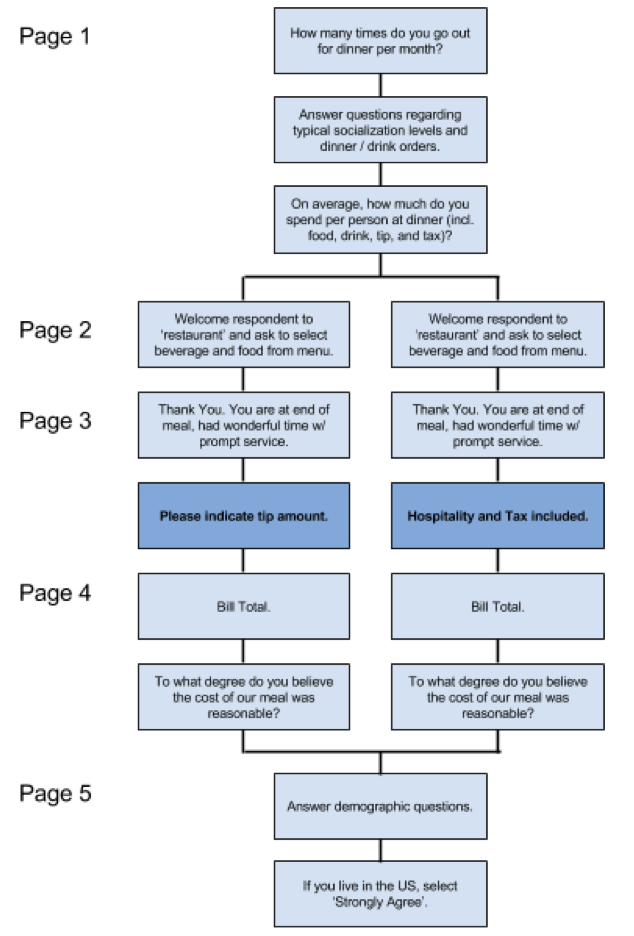

```{r setup, include=FALSE}
setwd("~/Desktop/w241/w241-Final-Project/")
library(stargazer)
library(lattice)
library(car)
library(knitr)
#library(foreign)
#library(data.table)
#library(AER)
#library(DataCombine)
#library(lmtest)
#library(sandwich)
#library(psych)

df = read.csv("DataforAnalysis2.csv")

# counts for control and treatment groups
n.control = length(df$total_tip[df$total_tip > 0])
n.treatment = length(df$total_no_tip[df$total_no_tip > 0])

###########################
##### Transformations #####
###########################

# Total price
df$total_ = ifelse(df$total_no_tip == 0, df$total_tip, df$total_no_tip)

names(df)[names(df) == "Q23"] = "tip" 

# Caculate pre-tip total price for the tipping group
df$total_pre_tip = df$total_tip - df$tip  
df$tip_pct = (df$tip / df$total_pre_tip) * 100

# Final Bill Price
df$final_price = ifelse(df$total_no_tip == 0, df$total_tip, df$total_no_tip)

names(df)[names(df) == "Q23"] = "tip" 

# Caculate pre-tip total price for the tipping group
df$total_pre_tip = df$total_tip - df$tip  
df$tip_pct = (df$tip / df$total_pre_tip) * 100

# Treatment flag
df$treat = ifelse(df$total_no_tip > 0, 1, 0)
levels(df$treat) = c("Tipping", "Fixed-Pricing")

# Rename some variables
names(df)[names(df) == "Q23.1"] = "gender" 
names(df)[names(df) == "Q24"] = "age" 
names(df)[names(df) == "Q5"] = "baseline_spend"
names(df)[names(df) == "Q26"] = "baseline_tip_pct"
names(df)[names(df) == "Q1_1"] = "baseline_eat_out" 

##########################################################
## Create new variables which contains 
## values for both treatment and control
###### Due to Qualtrics, the treatment and control 
###### answers start in different variables 

# Q7 and Q31 - Meals
df$meal_ordered = ifelse(df$Q7 == "", df$Q31, df$Q7)
levels(df$meal_ordered) = levels(df$Q7)

# Q16 and Q30 - Beverages
df$drink_ordered = ifelse(df$Q16 == "", df$Q30, df$Q16)
levels(df$drink_ordered) = levels(df$Q16)

# Q8 and Q35 - Reasonable Score
df$reasonable = ifelse(df$Q8 == "", df$Q35, df$Q8)

# Recode so that 1=Extremely unreasonable and 5=Extremely reasonable
  # It is originally ordered alphabetically

df$reasonable = recode(df$reasonable, "2=5; 3=1; 4=3; 5=4; 6=2")
levels(df$reasonable) = c("Extremely unreasonable",
                          "Somewhat unreasonable",
                          "Neither reasonable nor unreasonable",
                          "Somewhat reasonable",
                          "Extremely reasonable")

##########################################
######### Create Dummy Variables ######### 
##########################################

# Q2 - When going out to eat, who do you normally eat with?
df$Q2_family = ifelse(grepl("Family", df$Q2, ignore.case = T), 1, 0)
df$Q2_friends = ifelse(grepl("Friends", df$Q2, ignore.case = T), 1, 0)
df$Q2_alone = ifelse(grepl("alone", df$Q2, ignore.case = T), 1, 0)
df$Q2_spouse = ifelse(grepl("Spouse", df$Q2, ignore.case = T), 1, 0)
df$Q2_colleague = ifelse(grepl("Colleagues", df$Q2, ignore.case = T), 1, 0)

# Q3 - Which courses do you usually order?
df$Q3_mainCourse = ifelse(grepl("Main", df$Q3, ignore.case = T), 1, 0)
df$Q3_appetizer = ifelse(grepl("Appetizer", df$Q3, ignore.case = T), 1, 0)
df$Q3_dessert = ifelse(grepl("Dessert", df$Q3, ignore.case = T), 1, 0)

# Q4 - Which of the following drinks do you normally order?
df$Q4_water = ifelse(grepl("Water", df$Q4, ignore.case = T), 1, 0)
df$Q4_non_alc = ifelse(grepl("beverages", df$Q4, ignore.case = T), 1, 0)
df$Q4_beer = ifelse(grepl("beer", df$Q4, ignore.case = T), 1, 0)
df$Q4_cocktail = ifelse(grepl("Cocktail", df$Q4, ignore.case = T), 1, 0)
df$Q4_wine = ifelse(grepl("Wine", df$Q4, ignore.case = T), 1, 0)
```

Does all-inclusive (tax + tip) pricing at restaurants impact the customer perception of value?

# Introduction

Tipping varies around the world from countries such as Australia where tipping is not practiced, to countries such as Germany where rounding the bill up to the nearest Euro is the norm.  In the US, the expectation for tipping has slowly climbed from 10 to 15 to 18 to 20 percent over the past 100 years [^1].  Often a mandatory tip is added for large groups and some high-end restaurants automatically add an 18% experience or service charge.  While the idea of giving a small gratuity for services is old, the roots of modern US tipping practices go back to the post-Civil War era.  According to Saru Jayaraman of the Food Labor Research Center, UC Berkeley, tipping started as a way for train operators to avoid paying the newly-freed slaves and still have them earn an income [^2].  This practice continues today with the alternate minimum wage that restaurant owners are allowed to pay their staff on the premise that tips will make up the difference.

[^1]: Tuttle, B. (2014-09-18). 15 Things You Didn’t Know About Tipping.  Time Magazine.   Retrieved from http://time.com/money/3394185/tipping-myths-realities-history/ on 2017-05-02.

[^2]: Ferdman, R. A. (2016-02-18).  I dare you to read this and still feel good about tipping.  The Washington Post.  Retrieved from https://www.washingtonpost.com/news/wonk/wp/2016/02/18/i-dare-you-to-read-this-and-still-feel-ok-about-tipping-in-the-united-states/?utm_term=.a694c2615e80 on 2017-05-02.


This two-tiered system "traps many low-wage tipped restaurant workers in conditions of economic and social vulnerability" [^3].  A continually rising 'accepted' tip rate is not sustainable and the movement to create all-inclusive pricing is an attempt at addressing rising expected tips and low wages in the food industry.  If Americans are willing to bear the burden of the true cost of restaurants, then perhaps we can achieve better pay equality.  It is this concern of fairness and social responsibility that drives our research question.

[^3]: Food Labor Research Center  (2015-12).  Working Below The Line.  UC Berkeley. Retrieved from http://food.berkeley.edu/wp-content/uploads/2015/07/WorkingBelowTheLine_F2.pdf on 2017-05-02.

A small number of restaurants in cities such as San Francisco, Berkeley, and New York are attempting to address this by creating an all-inclusive pricing model.  Danny Meyer, a respected New York restaurateur, made a splash a few years ago when he announced he would move all of his restaurants to this pricing structure [^4].   While he has since retreated from using this model at some of his restaurants, the attempt to change the system still exists.  The question we seek to answer is the following: if a patron knows an establishment is tip-less, will they accept the higher price and feel that the additional cost is reasonable.  Our hypothesis is that they would be less satisfied with meal prices with this model.

[^4]: Sutton, R. (2015-10-14).  Danny Meyer is eliminating all tipping at his restaurants and significantly raising prices to make up the difference, a move that will raise wages, save the hospitality industry, and forever change how diners dine.    New York Eater.  Retrieved from https://ny.eater.com/2015/10/14/9517747/danny-meyer-no-tipping-restaurants on 2017-05-02.

# Experiment

At the start of our experimental design phase, we researched Bay Area restaurants that were offering all-inclusive pricing and reached out to a few restaurateurs we knew.  Asking a restaurant to randomly select patrons to give them separately priced menus or to switch up nights that they used one system or another seemed problematic.   We opted instead for a restaurant experience “thought experiment” design that would use a Qualtrics survey (see appendix) driven by subjects from Amazon Mechanical Turk.

## Qualtrics Survey

In brief, the survey design was to ask a few questions about the subject’s dining habits (appendix, page 1), then randomly assign the subject to the control or treatment group, where they would be presented with a menu of drink and food options (page 2).  They would then be presented with a bill and asked for a tip if they were in the control group (page 3).  They were shown the total bill amount and were asked if they felt the cost was reasonable (page 4).  They were then shown a final set of questions (page 5), and then the completion page with their Mechanical Turk code (page 6).  Below is the flow of the survey with control being on the left and treatment on the right.  The survey page numbers are called out on the left side for reference.

<center></center>

**Page 1** contained the basic covariates we were interested in for evaluating the survey results: Number of times eating out, who they normally dined with (multi-choice), which courses they normally ordered (multi-choice), what drinks they normally ordered (multi-choice), and their average spend per person when dining with a significant other.   (As an aside, in the appendix, the bottom right footer says 1/2; page 2 was blank and has been omitted.)

**Page 2 Control, Page 2 Treatment**:  We started with the text, "Welcome to our restaurant, please be seated.  Here is a menu, please look it over and select what you would like.  I will be back shortly."  For the food section of the menu we had several concerns.   One was that we did not want to provide a name for the restaurant as we felt this could influence the perception of pricing.  Certain words such as diner or café could be interpreted differently in different parts of the country, so we opted for no restaurant name.

We opted for a world cuisine loosely based on California- and New York- based restaurants, as we felt that a regional cuisine such as French or Italian would put people into a particular mind-set.  We wanted a mix of vegetarian and meat options and wanted to include an item that would be more familiar to North African/Mediterranean subjects.  For inspiration we reviewed the a la cart menus from Berkeley's Chez Pannise Cafe.  While we wanted to have a consistent feel in the language, we stayed away from words that would be unfamiliar to subjects while trying portray a higher level of dining and variety that would appeal to a broader audience.

Pricing was another issue that we worked through.  Prices are widely varied in the US depending on whether you are in an urban area or a rural part of the country.  We decided that we would focus on the urban areas.  While the prices on the control menu are inexpensive compared to Bay Area or New York dining, they are not overly low.  For the treatment menu, we chose a price that was about 30% higher on average (between 27% and 32%).  This number was selected on the idea that this would incorporate a 7% tax and an 18% gratuity with an a few additional percentage points of surcharge.  Also of note is that the dinner items were randomly shuffled for each survey.

We opted to add a beverage section, including a free water option, to give subjects the option to select a no-cost item, rather than requiring a beverage purchase.   For alcoholic beverages, prices in the treatment group were $1 higher than in the control group, with the exception of the cocktail, which was priced $2 higher, given that mixed drinks are more labor intensive.  These amounts were chosen to reflect typical tip amounts in urban areas.

We ended the treatment page with the text “Hospitality and tax included.”  This was loosely based on text that Danny Meyer used in his New York Restaurants.

**Page 3 Control, Page 3 Treatment**:  For page 3, the subjects were told that they had a wonderful time and service was prompt.  They were presented with an itemized bill.  The control group was then asked to provide a tip amount while the treatment group was again reminded that hospitality and tax were included.  (In the sample survey in the appendix, we show the same menu items for control and treatment, plus and a $7 tip on the control page.)

**Page 4** does not differ between Control and Treatment.  The two are broken out here to show the cost difference between the flows.

**Page 5**:  After our initial pilot study, we found that some participants were clicking through the survey in 30 seconds or less.  At the recommendation of the Qualtrics user guide, we added the question, “If you live in the U.S. select strongly agree”. Since we set location restrictions and only included people in the U.S. that means everyone should have selected "strongly agree". For people who did not choose "strongly agree", we can conclude that they were not paying attention to the survey and therefore we excluded their responses.   We also added questions on gender, age, and average tip amount in the hope of making this question less obvious to subjects that clicked through the survey.

**Page 6** is the end of the survey.

Since the cost of food and restaurants is quite varied across the United States, we also wanted to limit participation to only a few urban areas.

## Amazon Mechanical Turk

With Amazon Mechanical Turk, we set up a task with the description: “Let us know your experience and preference at restaurants (3-5 minute survey).”  While Qualtrics estimated the survey should take 6 minutes, the mean survey time was just over 2 minutes.   The task was offered at $ 0.30, which would place a 2-minute subject above the national minimum wage.

For our pilot studies we were able to quickly get the requested number of subjects, but for the actual survey, the $ 0.30 was on the low side, and it took twenty days before we decided to end the survey.  We had planned to stop after 330 responses (300 responses and a 10% overage for the inevitable re-takers from the pilot surveys).  The survey started on April 5th and only garnered three responses after three days.  We realized that we had one of the restrictions backwards (limit to users who have 0 tasks completed, switched to users who have more than 0 tasks completed). We restarted the survey on the 8th before finally deciding on Thursday April 20th to end the survey on Sunday April 23rd.  We did contemplate raising the price but felt that this would affect the results of the survey.  From these two sets we received 263 responses.

Finally we set up Mechanical Turk to limit data to California, New York, Pennsylvania, and Washington D.C.  Unfortunately Mechanical Turk does not provide a more fine-grained selection of areas, so we targeted high-population states as a proxy for urban areas.  The validation of the region selection data was done as one of our final pilots where we collected 30 subjects on April 3rd to validate that the region selections were working correctly.  During validation of the area restriction pilot, we examined the latitude and longitude in the data set to verify that subjects were in our target areas.  No other data was reviewed.  These were included to make up for the unreached number.

## Research Design (RXO Grammar)

Once we had established that we wanted to do a simple survey, our options for research design were limited, and we settled on a standard "RXO" model to satisfy our data needs. RXO stands for research, treatment, outcome which directly follows the one-time data collection we had our subjects step through in the survey.  First, we collected some covariate information, randomized them into treatment or control, applied the treatment or control menu and measured the outcome variable response in the final stage. While this isn't a particulalry sophisticated or unique model, it satisfies the purpose of running a between-subjects design on an outcome variable that could be affected by viewing it more than once. 

```{r, echo=FALSE}
Group = c("Treatment", "Control")
Randomization = c("R", "R")
Treatment = c("X", "--")
Outcome = c("O", "O")
knitr::kable(data.frame(Group, Randomization, Treatment, Outcome))
```

Our main concern with the treatment step of providing the subject with a bill with standard or all-inclusive pricing was the selection of the meal options. If we limited the menu to a single item, then taste or cost trends in a particular region may bias the results regardless of what the subject thinks about tipping, as well as not accurately simulating a real restaurant environment with a variety of options. Thus we made the choice to simulate a real menu as closely as possible with items across a range of pricing and ingredient options with the hope that at least one or two meals would appeal to the subjects' preferences and budget. One assumption this decision necessitated was that the subjects choose menu items using the same thought process as they would in store, considering cost as a factor. If we don't have this assumption, this study is relatively nonsensical as subjects may choose a meal outside of their price range and complain at its unreasonableness. We would not expect this type of behavior from an in-person interaction, and so for this experiment, we also expect the subjects to behave as they normally would.

## Measurement of Variables

We gathered a selection of covariate information from our subjects including general demographic data as well as specific questions related to their restaurant-related habits. Below is a table of the different variables we collected along with their types and options.

```{r, echo=FALSE, message=FALSE}
variables = read.csv("variables.csv")
knitr::kable(variables)
```

Please note that our outcome variable of the subject's impression of meal price reasonableness was measured using a Likert scale. This is standard practice for questionnaire data collection, and we think it accurately allows us to model their satisfaction with pricing. 

# Results

Over the span of this course we have used two different methods, linear modeling and randomization inference, to test whether our treatment variable had an effect on our outcome variable. In this section we will present our results using both of these methods as well as a Chi-squared test. Even though we did not discuss Chi-squared tests in this course, we are including it because it is designed for analyzing categorical variables, which we have this experiment.

Figure 1 shows the distribution of responses by treatment group. The average ratings were 3.29 for the treatment group and 3.76 for the control group giving us an average treatment effect of -0.47 before controlling for any other factors.

```{r, echo=FALSE}
# Hisograms of Reasonable Score
histogram(~ reasonable | levels(treat), data = df,
          main  = "Figure 1",
          xlab = "Rating",
          scales = list(x=list(labels=c("", "Very Unreasonable",
                                        "Somewhat Unreasonable",
                                        "Neither Reasonable\nnor Unreasonable",
                                        "Somewhat Reasonable",
                                        "Very Reasonable")),
                                              rot = 38,
                                              cex = 0.7,
                                              alternating = FALSE), 
          col = "steelblue"
          )
```

## Linear Modeling

Linear modeling allows us estimate the effect of our treatment variable while also controlling for covariates that may have played a role as well. \autoref{reasonableness_rating} shows three different models of our data. The first model is our "naive" model which uses treatment as the only predictor. The second model includes baseline spending, which is how much the respondent normally spends per person when going out to dinner. Finally, the third model adds in the number of times they normally eat out per month as well as fixed effects for age, gender, who they normally eat with, what courses they normally order, and what drinks they typically order. The third model includes all of the possible covariates that we could have included in our model in order to test whether anything would make a difference in the magnitude or standard error of our treatment estimate. These additional covariates did not do anything for the model and actually made the standard error larger.

Our best model is the second one, because it has the lowest standard error for the treatment variable and it has the highest adjusted R^2^. This model shows us an average treatment effect of -0.383 (standard error of 0.129) and a p-value of 0.004. Baseline spending is a significant covariate, but the effect size is only 0.024 or roughly 6% of the size of our treatment effect. Another things to note is that each model shows a statistically significant treatment effect and an ATE between -0.38 and -0.47. Since each model gave such similar results for the ATE, this is a good sign that our treatment truly had an effect and what we're seeing is not due to a poor model.

\pagebreak
```{r, echo=FALSE, results="asis", warning=FALSE}
# Naive model - treatment is the only predictor
model_naive = lm(reasonable ~ treat, data = df)

# Control for baseline_spending
model1 = lm(reasonable ~ treat + baseline_spend, data = df)

# Control for eating baseline dining habits
model2 = lm(reasonable ~ treat + Q2_colleague + Q2_spouse + Q2_alone + Q2_friends + Q2_family + Q3_dessert + Q3_appetizer + Q3_mainCourse + Q4_wine + Q4_cocktail + Q4_beer + Q4_non_alc + Q4_water + baseline_spend + baseline_eat_out + factor(gender) + factor(age), data = df)


stargazer(model_naive, model1, model2,
          header = FALSE,
          report = "vcsp*", 
          dep.var.labels=c("Reasonableness Rating"),
          omit = c("Q2", "Q3", "Q4", "age", "gender"),
          add.lines = list(c("Fixed Effects", "No", "No", "Yes")),
          covariate.labels=c("Treatment", 
                             "Baseline Spending", 
                             "Num Times Eat Out Per Month"),
          label = "reasonableness_rating"
          )
```


## Randomization Inference

The sharp null hypothesis states that the treatment effect is zero for every person, not just zero overall. In other words for each person, their potential outcomes to treatment and potential outcomes to control are exactly the same. Randomization inference assumes the sharp null hypothesis and allows us approximate the distribution of treatment estimates we would reach if the treatment had no effect. 

```{r, echo=FALSE, eval=FALSE}
set.seed(241)

# Empty vector to store ATE for each simulation
ate.outcomes = c()

# simulate 100,000 different assignments
for (i in 1:100000){
  treatment = sample( c(rep(0,n.control), rep(1,n.treatment)) ) #randomly assign treatments
  reasonable.trt = mean(df$reasonable[treatment==1])  #mean response - treatment group
  reasonable.ctl = mean(df$reasonable[treatment==0])  #mean response - control group
  est.ate = reasonable.trt - reasonable.ctl         #calculate ATE 
  ate.outcomes = c(ate.outcomes, est.ate)           #capture ATE for each simulation
}

# calculate the observed ATE
observed_ate = mean(df$reasonable[df$treat==1]) - mean(df$reasonable[df$treat==0])

# randomizations with a graeter ATE than our observed ATE
larger_ates_count = length(ate.outcomes[abs(ate.outcomes) >= abs(observed_ate)])

p_value = larger_ates_count / 100000
```

We used randomization inference to simulate 100,000 different treatment assignments, and therefore 100,000 different treatment estimates. This yielded us with a p-value of *0.00097* meaning we would have less than a 0.1% chance of observing our treatment effect by random chance. 

## Chi-Squared Test

Chi-Square tests are used for categorical data to determine if there is a difference between various groups. Since our outcome measure is a Likert-scale rating, it is an ordered category and not a truly continuous variable. Therefore, the Chi-Square test is an appropriate test for our data.

```{r, echo=FALSE, warning=FALSE}
# Pander
ReasonablenessRating = df$reasonable
Treatment = df$treat
chisq.test(table(ReasonablenessRating, Treatment) )
```

The results of our Chi-squared test further confirm what we saw in the linear models and randomization inference. With a p-value of 0.02, we reject the null hypothesis that the responses from the treatment and control groups are independent. To say that another way, the treatment and control outcomes have a different distribution and therefore the treatment itself changed the potential outcomes from one distribution of satisfaction to a different distribution.

## Overall Bill Price

One concern we had was that maybe people in the tipping group would decide to leave very small tips. With no ramifications for leaving a bad tip, they could decide to go that route and it would potentially influence our results. In Figure 2, we show the distribution of tip percentages left by respondents. There are a couple questionable values but overall the distribution of tip percentages looks good. The mean tip percentage is 18.7% (95% confidence interal of 17.7% - 19.8%) which is fairly normal therefore we feel that respondents treated the tips like they would in a normal restaurant setting. 

```{r, echo=FALSE}
# Hisograms of Tipping Percentage
histogram(df$tip_pct,
          xlab = "Tip Percentage",
          col = "steelblue",
          main = "Figure 2",
          breaks = 15)

avg_tip = mean(df$tip_pct, na.rm = TRUE)


# t.test(df$tip_pct)      # t-test to give the 95% CI for mean tip pct
```


Another concern of ours was that there would be different bill prices between the treatment and control group. In other words, the average bill prices for the treatment and control groups would be different because one group thought the prices were more reasonable than the other. The direction of this effect could go either way. Maybe one group feels the prices are so reasonable that they order more food, or they feel the prices are so unreasonable that they opt for the cheapest dish in the hopes of making the bill as tolerable as possible. 

```{r, echo=FALSE} 
# Hisograms of Final Bill Price
histogram(~ final_price | levels(treat), data = df, 
          xlab = "Final Bill Price ($)",
          col = "steelblue",
          alternating = FALSE,
          main = "Figure 3")

# Average price per treatment group
avg_bill_trt = mean(df$final_price[df$treat==1])
avg_bill_ctl = mean(df$final_price[df$treat==0])

pval_price_diff = t.test(df$final_price[df$treat==1], df$final_price[df$treat==0])[3]
```

Figure 3 shows the total bill prices including meal, 7% tax, and tip (if applicable). The average total bill prices were \$`r round(avg_bill_trt,2)` for the treatment group and \$`r round(avg_bill_ctl,2)` for the control group. This means that on average, the tipping group spent more money but was thought the cost was more reasonable. However, a t-test on the difference in bill prices between the two groups gives a p-value of `r pval_price_diff` meaning we cannot conclude that the bill prices were significantly different between the two groups.


## Conclusion

Our initial hypothesis was that subjects would be less satisfied with all-inclusive pricing than standard tipping pricing, and we believe the data support that position. The regression model including all major covariates showed only two fields to be significant in predicting the subjects' views on meal price reasonableness: baseline meal spending and the treatment of all-inclusive pricing. The former seems consistent in that those higher spending may have had budgets beyond our meal pricing, and the latter supports our theory with the greatest coefficient in the model. We received further confirmation in the lack of significant difference in average meal price between treatment and contro, indicating that while the groups had similar spending habits, their customer satisfaction levels with pricing were indeed different. 
